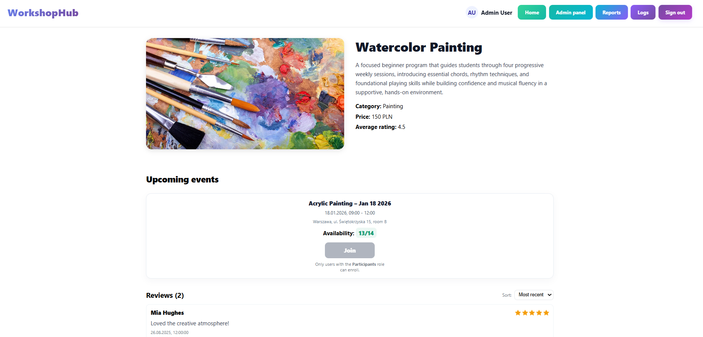
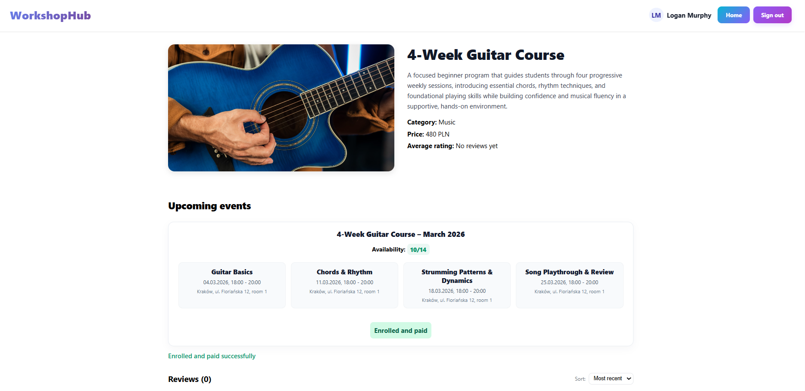
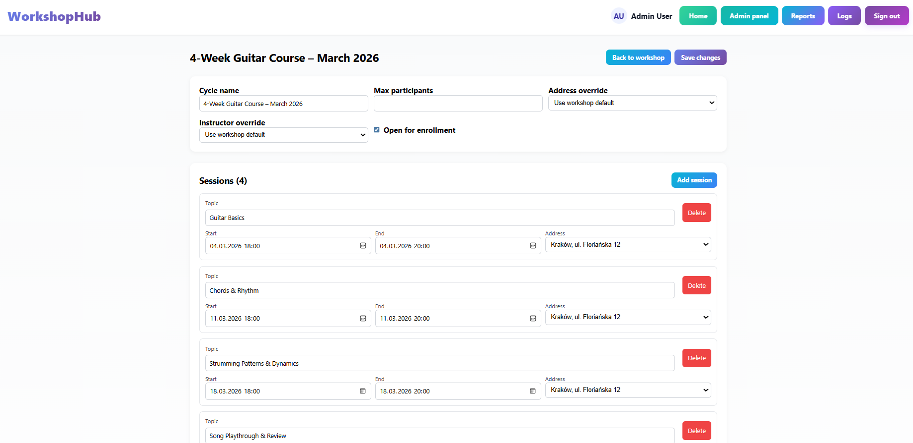
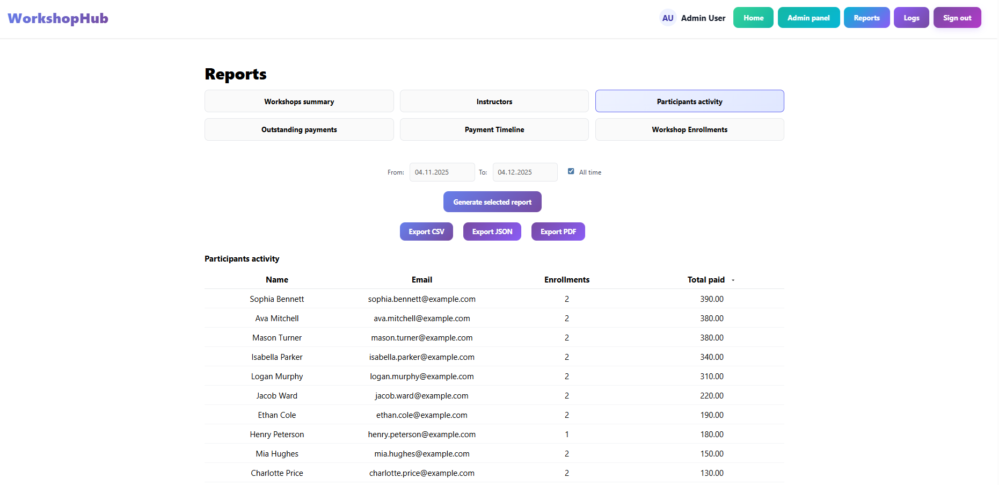
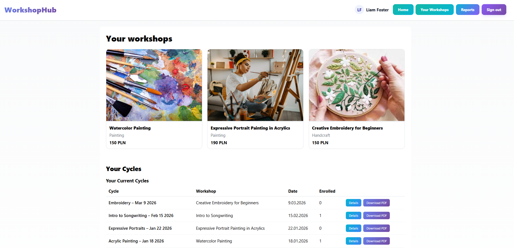
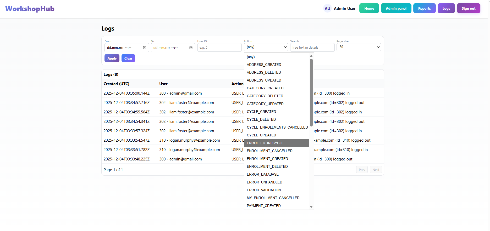

# Dokumentacja Projektu - WorkshopHub

## Informacje podstawowe

**Autor:** Kinga Mazur  
**Temat:** System Zarządzania Warsztatami (Workshop Management System)  
**Technologie:** ASP.NET Core 8.0, React 18, SQL Server  
**Język:** C#, JavaScript, T-SQL  

## Spis Treści

1. [Opis Projektu](#1-opis-projektu)
2. [Jak Uruchomić Projekt](#2-jak-uruchomić-projekt)
3. [Architektura Systemu](#3-architektura-systemu)
4. [Model Bazy Danych (ERD)](#4-model-bazy-danych-erd)
5. [Logika Biznesowa](#5-logika-biznesowa)
6. [Skrypty SQL](#6-skrypty-sql)
7. [API Endpoints](#7-api-endpoints-wybrane)
8. [Mocne Strony Projektu](#8-mocne-strony-projektu)
9. [Screenshoty Aplikacji](#9-screenshoty-aplikacji)

## 1. Opis Projektu

WorkshopHub to zaawansowana aplikacja webowa zaprojektowana do kompleksowego zarządzania warsztatami edukacyjnymi, kursami, szkoleniami i eventami. System łączy w sobie funkcjonalności platformy edukacyjnej, systemu rezerwacyjnego i narzędzia administracyjnego, umożliwiając efektywną organizację zajęć oraz zarządzanie uczestnikami.

### 1.1. Główne funkcjonalności

**Zarządzanie warsztatami**
System umożliwia tworzenie, edycję i usuwanie warsztatów z podziałem na kategorie tematyczne (muzyka, malarstwo, fotografia, kulinaria, rękodzieło, sztuka cyfrowa). Każdy warsztat może być:
- **Jednorazowym eventem** (single event) - np. sobotnie warsztaty malarskie
- **Serią zajęć** (workshop series) - np. 10-tygodniowy kurs programowania z harmonogramem poszczególnych sesji

**System ról i uprawnień**
Aplikacja implementuje trzypoziomowy system ról:
- **Administrator** - pełny dostęp do systemu, zarządzanie użytkownikami, warsztatami, generowanie raportów
- **Instruktor** - tworzenie i zarządzanie własnymi warsztatami, dostęp do list uczestników, raporty własnej aktywności
- **Uczestnik** - przeglądanie oferty, zapisywanie się na warsztaty, wystawianie opinii

Użytkownicy mogą posiadać wiele ról jednocześnie (np. instruktor może być jednocześnie uczestnikiem innych warsztatów).

**Cykle i edycje**
System obsługuje wielokrotne edycje tego samego warsztatu:
- Możliwość tworzenia wielu cykli jednego warsztatu (np. kurs angielskiego - edycja wiosenna, letnia, jesienna)
- Override parametrów dla poszczególnych edycji (cena, limit miejsc, lokalizacja, instruktor)
- Niezależne zarządzanie zapisami dla każdego cyklu

**Zapisy uczestników**
Zaawansowany system zapisów z:
- Automatycznym sprawdzaniem dostępności miejsc (capacity check)
- Ochroną przed race condition (transakcje SERIALIZABLE)
- Możliwością anulowania zapisów przez uczestników i administratorów
- Historią zapisów ze statusami (Active, Cancelled)

**Obsługa płatności**
Automatyczne śledzenie płatności:
- Tworzenie płatności przy zapisie na płatny warsztat
- Statusy: Pending (oczekuje), Paid (opłacone), Cancelled (anulowane)
- Możliwość zmiany statusu przez administratora
- Automatyczne anulowanie płatności przy anulowaniu zapisu

**System opinii i ocen**
Uczestnicy mogą wystawiać oceny (1-5 gwiazdek) i komentarze do warsztatów. Średnia ocena jest automatycznie przeliczana przez trigger SQL i wyświetlana przy każdym warsztacie.

**Raporty i eksport danych**
System generuje 6 typów raportów w formatach PDF, CSV i JSON:
1. Raporty warsztatów (statystyki, liczba zapisów, średnia ocena)
2. Wydajność instruktorów (liczba prowadzonych cykli, przychody, oceny)
3. Aktywność uczestników (liczba uczestniczonych warsztatów, wydane kwoty)
4. Nieopłacone płatności (z filtrowaniem po dacie i kwocie)
5. Listy uczestników dla poszczególnych cykli
6. Osobiste warsztaty użytkownika

**Audyt i logowanie**
Automatyczne logowanie wszystkich zmian w bazie danych:
- Triggery SQL rejestrują operacje INSERT, UPDATE, DELETE
- Zapisywane są stare i nowe wartości w formacie JSON
- Śledzenie użytkownika wykonującego operację (SESSION_CONTEXT)
- Panel logów dostępny dla administratorów

### 1.2. Technologie i architektura

**Backend:** ASP.NET Core 8.0 z Entity Framework Core, RESTful API, JWT Authentication  
**Frontend:** React 18 z Vite, React Router v7, Axios  
**Baza danych:** SQL Server z triggerami, stored procedures i funkcjami użytkownika  
**Bezpieczeństwo:** BCrypt (hashowanie haseł), role-based authorization, CORS  
**Dodatkowe:** QuestPDF (generowanie PDF), ImageSharp (przetwarzanie obrazków)

### 1.3. Kluczowe cechy techniczne

- **Relacyjny model bazy danych** - 13 znormalizowanych tabel z integralnością referencyjną
- **Automatyka** - triggery SQL do przeliczania średnich ocen i logowania zmian
- **Transakcje** - izolacja SERIALIZABLE zapobiegająca race conditions przy zapisach
- **Override pattern** - możliwość nadpisywania parametrów na poziomie cyklu/sesji
- **Cascade delete** - automatyczne usuwanie powiązanych danych
- **Upload obrazków** - warsztaty z grafiką, automatyczna miniaturyzacja
- **Responsywny interfejs** - działa na urządzeniach desktop i mobile

---

## 2. Jak Uruchomić Projekt

### 2.1. Wymagania

- .NET 8.0 SDK
- Node.js 18+
- SQL Server LocalDB
- PowerShell (do automatycznego setupu bazy)

### 2.2. Krok po kroku

**1. Sklonuj repozytorium**
```bash
git clone https://github.com/Z4phxr/Workshop_App.git
cd Workshop_App/Projekt
```

**2. Zainstaluj zależności backend**
```bash
dotnet restore
```

**3. Utwórz bazę danych (EF Migrations)**
```bash
dotnet ef database update
```

Ta komenda:
- Tworzy nową bazę WorkshopSystemDB w LocalDB
- Uruchamia wszystkie migracje (tworzy 13 tabel)
- Konfiguruje relacje i constraints
- Seeduje dane startowe

**4. Uruchom backend**
```bash
dotnet run
```
Backend będzie dostępny pod `https://localhost:7271`

**5. Uruchom frontend (nowy terminal)**
```bash
cd ClientApp
npm install
npm run dev
```
Frontend będzie dostępny pod `http://localhost:5173`

### 2.3. Konto Admina (testowanie)

- Email: admin@gmail.com
- Hasło: adminadmin

---

## 3. Architektura Systemu

### 3.1. Warstwa Backend (ASP.NET Core 8.0)

**Wzorzec:** MVC (Model-View-Controller) + RESTful API

```
Projekt/
├── Controllers/       # Kontrolery API (endpointy REST)
├── Models/           # Modele encji (tabele bazy danych)
├── Data/             # DbContext i konfiguracje EF Core
├── Services/         # Logika biznesowa (interfejsy + implementacje)
├── DTOs/             # Data Transfer Objects (dla requestów/responsów)
└── Database/         # Skrypty SQL (triggery, procedury, funkcje)
```


### 3.2. Warstwa Frontend (React 18 + Vite)

**Wzorzec:** Component-based architecture

```
ClientApp/src/
├── components/       # Komponenty wielokrotnego użytku
│   ├── AdminNavbar.jsx
│   ├── EnrollmentList.jsx
│   └── WorkshopCard.jsx
├── pages/           # Strony aplikacji (routy)
│   ├── Home.jsx
│   ├── Login.jsx
│   ├── Register.jsx
│   ├── AdminDashboard.jsx
│   ├── WorkshopDetails.jsx
│   └── ...
├── utils/           # Pomocnicze funkcje
│   └── api.js       # Axios client
└── hooks/           # Custom React hooks
    └── useAuth.js   # Hook do autoryzacji
```

### 3.3. Warstwa Bazy Danych (SQL Server)

**Model:** Relacyjna baza danych z 13 tabelami

---

## 4. Model Bazy Danych (ERD)

### 4.1. Diagram ERD


### 4.2. Opis encji

#### **Users** (Użytkownicy)
Przechowuje dane użytkowników systemu. Hasła są hashowane.

**Pola:**
- `Id` klucz główny (IDENTITY)
- `Email` unikalny adres email
- `FirstName`, `LastName` imię i nazwisko
- `PasswordHash` zahashowane hasło
- `CreatedAt` data rejestracji

**Relacje:**
- **1:N** z `Enrollments` (użytkownik może mieć wiele zapisów)
- **1:N** z `Reviews` (użytkownik może wystawiać wiele opinii)
- **M:N** z `Roles` przez `UserRoles` (użytkownik może mieć wiele ról)

#### **Roles** (Role)
Słownik ról systemowych.

**Pola:**
- `Id` klucz główny (seeded: 1=Admin, 2=Instructor, 3=Participant)
- `Name` nazwa roli (UNIQUE)

**Wbudowane role:**
- **Admin** (Id=1) pełen dostęp do systemu
- **Instructor** (Id=2) zarządzanie własnymi warsztatami, raporty
- **Participant** (Id=3) zapisywanie się na warsztaty, wystawianie opinii

#### **UserRoles** (Przypisania ról)
Tabela łącząca Many-to-Many między Users a Roles.

**Pola:**
- `UserId` FK do Users
- `RoleId` FK do Roles

**Dlaczego Many-to-Many?**
Użytkownik może mieć wiele ról jednocześnie (np. Instructor + Participant).

#### **Categories** (Kategorie warsztatów)
Słownik kategorii warsztatów.

**Pola:**
- `Id` klucz główny (IDENTITY zaczyna od 1001)
- `Name` nazwa kategorii (UNIQUE)
- `Description` opis kategorii

#### **Addresses** (Adresy)
Adresy lokalizacji warsztatów.

**Pola:**
- `Id` klucz główny
- `Street`, `BuildingNumber` ulica i numer budynku
- `City` miasto
- `PostalCode` kod pocztowy
- `Room` numer sali/pokoju
- `AdditionalInfo` dodatkowe informacje (np. piętro, dojazd)

**Dlaczego osobna tabela?**
Warsztaty mogą odbywać się w różnych lokalizacjach. Osobna tabela pozwala na:
- Reużywanie adresów
- Override na poziomie cyklu lub sesji (np. wykład w innej sali)

#### **Workshops** (Warsztaty)
Główna tabela warsztatów.

**Pola:**
- `Id` klucz główny
- `Title` tytuł warsztatu
- `Description` opis
- `IsSeries` czy warsztat jest serią (true) czy jednorazowym eventem (false)
- `Price` cena bazowa
- `MaxParticipants` domyślny limit uczestników (NULL = bez limitu)
- `CategoryId` FK do Categories
- `AddressId` FK do Addresses (domyślna lokalizacja)
- `DefaultInstructorId` FK do Users (główny instruktor)
- `ImageUrl` URL obrazka warsztatu
- `ThumbnailUrl` URL miniaturki
- `AverageRating` średnia ocena (automatycznie przeliczana przez trigger)
- `CreatedAt` data utworzenia

**Relacje:**
- **1:N** z `WorkshopCycles` (warsztat może mieć wiele cykli/edycji)
- **1:N** z `Reviews` (warsztat może mieć wiele opinii)

**Dlaczego `IsSeries`?**
- **Series (true):** Warsztat składa się z wielu sesji (np. kurs programowania, 10 spotkań)
- **Single Event (false):** Warsztat to jednorazowe wydarzenie (np. warsztaty malarskie, 1 dzień)

#### **WorkshopCycles** (Cykle warsztatów)
Edycje/cykle warsztatów. Jeden warsztat może mieć wiele cykli (np. kurs angielskiego edycja letnia, zimowa).

**Pola:**
- `Id` klucz główny
- `WorkshopId` FK do Workshops
- `DisplayName` nazwa wyświetlana (np. "Angielski Lato 2025")
- `StartDate`, `EndDate` daty rozpoczęcia i zakończenia cyklu
- `IsOpenForEnrollment` czy zapisy są otwarte
- `MaxParticipantsOverride` nadpisanie limitu z warsztatu (opcjonalne)
- `PriceOverride` nadpisanie ceny z warsztatu (opcjonalne)
- `AddressId` nadpisanie adresu z warsztatu (opcjonalne)
- `InstructorOverrideId` nadpisanie instruktora z warsztatu (opcjonalne)

**Relacje:**
- **1:N** z `WorkshopSessions` (cykl może mieć wiele sesji)
- **1:N** z `Enrollments` (cykl może mieć wielu zapisanych uczestników)

**Dlaczego override pól?**
Np. edycja zimowa może być droższa, w innej lokalizacji, z innym instruktorem.

#### **WorkshopSessions** (Sesje warsztatów)
Pojedyncze spotkania/zajęcia w ramach cyklu.

**Pola:**
- `Id` klucz główny
- `WorkshopCycleId` FK do WorkshopCycles
- `Topic` temat sesji (np. "Wprowadzenie do zmiennych")
- `StartTime`, `EndTime` dokładne godziny rozpoczęcia i zakończenia
- `AddressId` nadpisanie adresu (opcjonalne, np. wykład w innej sali)

**Relacje:**
- **M:N** z `Users` (instruktorzy) przez `InstructorAssignments`

**Dlaczego osobna tabela?**
Dla warsztatów typu Series każde spotkanie może mieć:
- Inny temat
- Inną godzinę
- Inną salę
- Innego instruktora

#### **Enrollments** (Zapisy)
Zapisy uczestników na cykle warsztatów.

**Pola:**
- `Id` klucz główny
- `UserId` FK do Users (kto się zapisał)
- `WorkshopCycleId` FK do WorkshopCycles (na jaki cykl)
- `EnrolledAt` data zapisu
- `Status` status zapisu (Active, Cancelled)
- `CancelledAt` data anulowania (NULL jeśli aktywny)

**Relacje:**
- **1:N** z `Payments` (zapis może mieć wiele płatności, np. opłata + dopłata)

**Statusy:**
- **Active** aktywny zapis
- **Cancelled** anulowany (przez użytkownika lub admina)

#### **Payments** (Płatności)
Płatności związane z zapisami.

**Pola:**
- `Id` klucz główny
- `EnrollmentId` FK do Enrollments
- `Amount` kwota
- `Status` status płatności (Pending, Paid, Cancelled)
- `CreatedAt` data utworzenia
- `PaidAt` data opłacenia (NULL jeśli niepłacone)

**Statusy:**
- **Pending** oczekuje na płatność
- **Paid** opłacone
- **Cancelled** anulowane (przy anulowaniu zapisu)

**Automatyka:**
Przy zapisie na warsztat automatycznie tworzona jest płatność (jeśli `Price > 0`) przez stored procedure `sp_RegisterUserToWorkshop`.

#### **Reviews** (Opinie)
Opinie i oceny warsztatów wystawiane przez uczestników.

**Pola:**
- `Id` klucz główny
- `UserId` FK do Users (kto wystawił opinię)
- `WorkshopId` FK do Workshops (do którego warsztatu)
- `Rating` ocena (1-5) z CHECK CONSTRAINT
- `Comment` komentarz tekstowy (opcjonalny)
- `CreatedAt` data wystawienia

**Automatyka:**
Przy dodaniu/edycji/usunięciu opinii trigger `tr_Reviews_RecalculateWorkshopRating` automatycznie przelicza średnią ocen i zapisuje w `Workshops.AverageRating`.

#### **InstructorAssignments** (Przypisania instruktorów)
Przypisania instruktorów do warsztatów/cykli/sesji.

**Pola:**
- `Id` klucz główny
- `InstructorId` FK do Users (który instruktor)
- `WorkshopId` FK do Workshops (opcjonalne)
- `WorkshopCycleId` FK do WorkshopCycles (opcjonalne)
- `WorkshopSessionId` FK do WorkshopSessions (opcjonalne)
- `IsLead` czy to główny instruktor (Boolean)

**Dlaczego potrzebne?**
- Warsztat może mieć wielu instruktorów (współprowadzenie)
- Cykl może mieć innego instruktora niż domyślny warsztat
- Sesja może mieć gościnnego wykładowcę

**Hierarchia override:**
1. Sesja (najwyższy priorytet)
2. Cykl
3. Warsztat (DefaultInstructorId)

#### **Logs** (Logi audytowe)
Automatyczne logowanie zmian w bazie danych przez triggery.

**Pola:**
- `Id` klucz główny
- `TableName` nazwa tabeli (np. "Users", "Workshops")
- `RecordId` ID zmodyfikowanego rekordu
- `Action` rodzaj operacji (INSERT, UPDATE, DELETE)
- `UserId` kto wykonał operację (z SESSION_CONTEXT)
- `ChangedAt` kiedy
- `OldValues` stare wartości (JSON)
- `NewValues` nowe wartości (JSON)

**Triggery:**
- `tr_Users_Log` loguje zmiany w Users
- `tr_Workshops_Log` loguje zmiany w Workshops
- (Można dodać dla innych tabel)

**SESSION_CONTEXT:**
Przed każdą operacją backend ustawia `AppUserId` w SESSION_CONTEXT, dzięki czemu trigger wie kto wykonał operację.

---

## 5. Logika Biznesowa

### 5.1. Rejestracja i Logowanie

**Flow rejestracji:**
1. Użytkownik wypełnia formularz (email, hasło, imię, nazwisko)
2. `POST /api/auth/register`
3. Backend hashuje hasło (BCrypt)
4. Tworzy rekord w `Users`
5. Automatycznie przypisuje rolę `Participant` (RoleId=3)
6. Zwraca JWT token

**Flow logowania:**
1. Użytkownik podaje email i hasło
2. `POST /api/auth/login`
3. Backend weryfikuje hasło
4. Generuje JWT token z claims (UserId, Email, Roles)
5. Frontend zapisuje token w `localStorage`

**JWT Claims:**
```json
{
  "nameid": "123",
  "email": "user@example.com",
  "role": ["Participant", "Instructor"],
  "exp": 1735689600
}
```

**Autoryzacja:**
- `[AllowAnonymous]` endpoint publiczny
- `[Authorize]` wymaga zalogowania
- `[Authorize(Roles = "Admin")]` tylko Admin
- `[Authorize(Roles = "Admin,Instructor")]` Admin lub Instructor

---

### 5.2. Tworzenie Warsztatu

**Flow (tylko Admin):**
1. Admin wypełnia formularz (tytuł, opis, kategoria, cena, adres, instruktor, obrazek)
2. `POST /api/workshops`
3. Backend:
   - Waliduje dane (ModelState)
   - Sprawdza czy kategoria istnieje
   - Sprawdza czy adres istnieje
   - Sprawdza czy instruktor ma rolę "Instructor"
   - Sprawdza czy warsztat o tej nazwie już nie istnieje (konflikt)
   - Uploaduje obrazek (jeśli przesłany) do `/wwwroot/workshop-images/`
   - Tworzy rekord w `Workshops`
   - Tworzy rekord w `InstructorAssignments` (przypisanie głównego instruktora)
   - Trigger `tr_Workshops_Log` loguje operację
4. Zwraca utworzony warsztat

**Obrazki:**
- Zapisywane lokalnie w `/wwwroot/workshop-images/`
- Nazwa pliku: `{GUID}.{extension}`
- URL zapisany w `ImageUrl` i `ThumbnailUrl`
- Limit rozmiaru: 5MB

---

### 5.3. Tworzenie Cyklu/Edycji Warsztatu

**Flow (Admin lub właściciel warsztatu):**

**Dla warsztatów typu Series:**
1. `POST /api/workshopcycles`
2. Backend:
   - Tworzy `WorkshopCycle`
   - Domyślna nazwa: "{Title} - {Miesiąc Rok}"
   - `StartDate` = teraz (lub podana data)
   - `EndDate` = NULL (określi się po dodaniu sesji)

**Dla warsztatów typu Single Event:**
1. `POST /api/workshopcycles/single`
2. Backend:
   - Tworzy `WorkshopCycle` + jedną `WorkshopSession`
   - `StartDate` = data eventu + godzina rozpoczęcia
   - `EndDate` = data eventu + godzina zakończenia
   - Sesja dziedziczy wszystkie parametry cyklu

**Override parametrów:**
- Można nadpisać `MaxParticipants`, `Price`, `AddressId`, `InstructorId`
- Jeśli NULL, używane są wartości z warsztatu

---

### 5.4. Zapis na Warsztat

**Flow (wszyscy zalogowani użytkownicy):**
1. Użytkownik klika "Zapisz się" na stronie warsztatu
2. `POST /api/enrollments/join` + `{ workshopCycleId: 123 }`
3. Backend (transakcja SERIALIZABLE - zapobiega race condition):
   - Sprawdza czy cykl istnieje i jest otwarty
   - Sprawdza czy użytkownik już nie jest zapisany (Active enrollment)
   - Sprawdza dostępne miejsca (capacity check z lockiem)
   - Tworzy `Enrollment` (Status=Active)
   - Jeśli `Price > 0`, tworzy `Payment` (Status=Pending)
   - Commit transakcji
4. Zwraca success

**Race condition protection:**
Używam `IsolationLevel.Serializable` + liczenie miejsc w transakcji - zapobiega sytuacji gdzie dwóch użytkowników zapisuje się jednocześnie na ostatnie miejsce.

**Alternatywna metoda (Stored Procedure):**
`sp_RegisterUserToWorkshop` - robi to samo w T-SQL.

---

### 5.5. Płatności

**Automatyka:**
- Przy zapisie automatycznie tworzona `Payment` (jeśli `Price > 0`)
- Status początkowo `Pending`

**Zmiana statusu (Admin/Instructor):**
1. `PUT /api/payments/{id}`
2. Body: `{ status: "Paid" }`
3. Backend:
   - Ustawia `Status = Paid`
   - Ustawia `PaidAt = DateTime.UtcNow`

**Anulowanie płatności:**
Przy anulowaniu zapisu (`PUT /enrollments/{id}/cancel`) automatycznie anulowane są wszystkie `Pending` płatności.

---

### 5.6. Opinie i Oceny

**Flow:**
1. Uczestnik klika "Wystaw opinię" (po zakończeniu warsztatu)
2. Wypełnia formularz (ocena 1-5, komentarz)
3. `POST /api/reviews`
4. Backend:
   - Waliduje rating (1-5)
   - Tworzy `Review`
   - Trigger `tr_Reviews_RecalculateWorkshopRating` automatycznie:
     - Liczy AVG(Rating) dla warsztatu
     - Zapisuje w `Workshops.AverageRating`
5. Średnia ocena widoczna natychmiast na stronie warsztatu

**Edycja opinii:**
`PUT /api/reviews/{id}` - tylko własnych opinii (lub Admin może wszystkie)

**Usunięcie opinii:**
`DELETE /api/reviews/{id}` - trigger ponownie przeliczy średnią

---

### 5.7. Raporty (Admin/Instructor)

Backend oferuje 6 raportów:

**1. Warsztaty (Workshops Report)**
- `GET /api/reports/workshops?format=pdf|csv|json`
- Lista wszystkich warsztatów z podstawowymi statystykami
- Pola: Id, Title, Category, Price, Active Enrollments, Average Rating

**2. Instruktorzy (Instructors Performance)**
- `GET /api/reports/instructors?format=pdf|csv|json`
- Stored Procedure: `GetInstructorPerformance`
- Pola: Instructor Name, Cycles Count, Revenue, Refunds, Average Rating
- Sortowanie: name, cycles, revenue, rating
- Paginacja: page, pageSize

**3. Uczestnicy (Participants Report)**
- `GET /api/reports/participants?format=pdf|csv|json`
- Lista użytkowników z rolą Participant
- Pola: Name, Email, Workshops Attended, Total Spent

**4. Płatności (Payments Report)**
- `GET /api/reports/payments/outstanding?format=pdf|csv|json`
- Stored Procedure: `GetOutstandingPayments`
- Lista nieopłaconych płatności (Status=Pending)
- Pola: Payment Id, User Name, Email, Amount, Days Pending
- Filtry: olderThanDays, minAmount

**5. Lista uczestników cyklu (Enrollment Roster)**
- `GET /api/workshopcycles/{id}/enrollments/pdf`
- `GET /api/workshopcycles/{id}/enrollments/download` (CSV)
- Lista zapisanych osób na dany cykl
- Pola: Name, Email, Paid Status, Enrollment Date

**6. Warsztaty użytkownika (User Workshops)**
- `GET /api/enrollments/mine`
- Lista warsztatów na które użytkownik jest zapisany
- Pola: Workshop Title, Cycle Name, Status, Payment Status

**Formaty eksportu:**
- **PDF:** QuestPDF (tabele z headerami, footer z datą)
- **CSV:** Plain text, UTF-8, separatory przecinek
- **JSON:** Standardowy JSON array

---

## 6. Skrypty SQL

### 6.1. Stored Procedures

#### **sp_RegisterUserToWorkshop**
Zapisuje użytkownika na warsztat i tworzy płatność.

```sql
EXEC sp_RegisterUserToWorkshop @UserId=5, @WorkshopCycleId=10;
```

**Co robi:**
1. Sprawdza czy użytkownik już nie jest zapisany
2. Pobiera cenę (PriceOverride lub Price warsztatu)
3. Tworzy Enrollment
4. Tworzy Payment (jeśli cena > 0)
5. Zwraca EnrollmentId, PaymentId, Amount

#### **sp_CancelEnrollment**
Anuluje zapis użytkownika.

```sql
EXEC sp_CancelEnrollment @EnrollmentId=15, @ActorUserId=1, @Reason='User request';
```

**Co robi:**
1. Ustawia Enrollment.Status = 'Cancelled'
2. Ustawia Enrollment.CancelledAt = GETUTCDATE()
3. Anuluje wszystkie Pending płatności (Status='Cancelled')

#### **GetInstructorPerformance**
Raport wydajności instruktorów (używany w ReportsController).

```sql
EXEC GetInstructorPerformance 
    @FromDate='2025-01-01', 
    @ToDate='2025-12-31',
    @Page=1,
    @PageSize=20,
    @SortBy='revenue',
    @SortDir='desc';
```

**Co zwraca:**
- InstructorId, Name, CyclesCount, Revenue, Refunds, AverageRating
- Paginacja (ROW_NUMBER)
- Total count w drugim result set

#### **GetOutstandingPayments**
Lista nieopłaconych płatności (używany w ReportsController).

```sql
EXEC GetOutstandingPayments
    @OlderThanDays=7,
    @MinAmount=50.00,
    @Page=1,
    @PageSize=20,
    @SortBy='created',
    @SortDir='desc';
```

**Co zwraca:**
- PaymentId, EnrollmentId, UserId, Name, Email, Amount, DaysPending
- Filtruje tylko Status='Pending'
- Opcjonalne filtry: starsze niż X dni, kwota >= Y

---

### 6.2. Functions (Funkcje SQL)

#### **fn_DaysUntil**
Oblicza ile dni zostało do podanej daty.

```sql
SELECT dbo.fn_DaysUntil('2025-12-31') AS DaysLeft;
```

**Użycie:**
W kontrolerze `EnrollmentsController.GetMyUpcomingWithCountdown()` do obliczania countdown do najbliższej sesji.

#### **fn_IsCycleOpen**
Sprawdza czy cykl jest otwarty na zapisy.

```sql
SELECT dbo.fn_IsCycleOpen(10) AS IsOpen;
```

**Logika:**
1. Pobiera IsOpenForEnrollment, StartDate, EndDate
2. Jeśli IsOpenForEnrollment=1 AND (teraz < EndDate OR brak EndDate) → 1
3. Inaczej → 0

---

### 6.3. Triggers

#### **tr_Reviews_RecalculateWorkshopRating**
Automatyczne przeliczanie średniej oceny warsztatu.

**Wyzwalany przez:**
- INSERT na Reviews
- UPDATE na Reviews
- DELETE na Reviews

**Logika:**
1. Zbiera WorkshopId z inserted/deleted
2. Dla każdego WorkshopId:
   - Liczy AVG(Rating)
   - UPDATE Workshops SET AverageRating = AVG

**Dlaczego trigger?**
Średnia zawsze aktualna, nie trzeba ręcznie przeliczać.

---

#### **tr_Users_Log**
Loguje zmiany w tabeli Users.

**Wyzwalany przez:**
- INSERT, UPDATE, DELETE na Users

**Logika:**
1. Określa Action (INSERT/UPDATE/DELETE)
2. Pobiera UserId z SESSION_CONTEXT (kto wykonał operację)
3. Zapisuje OldValues i NewValues jako JSON
4. INSERT do Logs

**SESSION_CONTEXT:**
Backend przed każdą operacją wywołuje:
```sql
EXEC sp_set_session_context 'AppUserId', 123;
```
Dzięki temu trigger wie kto wykonał operację.

---

#### **tr_Workshops_Log**
Analogicznie jak `tr_Users_Log` ale dla tabeli Workshops.

---

## 7. API Endpoints (wybrane)

### 7.1. Auth

| Method | Endpoint | Opis | Auth |
|--------|----------|------|------|
| POST | `/api/auth/register` | Rejestracja nowego użytkownika | AllowAnonymous |
| POST | `/api/auth/login` | Logowanie (zwraca JWT) | AllowAnonymous |
| POST | `/api/auth/logout` | Wylogowanie (opcjonalne) | Authorize |

### 7.2. Workshops

| Method | Endpoint | Opis | Auth |
|--------|----------|------|------|
| GET | `/api/workshops` | Lista wszystkich warsztatów | AllowAnonymous |
| GET | `/api/workshops/{id}` | Szczegóły warsztatu | AllowAnonymous |
| GET | `/api/workshops/mine` | Warsztaty instruktora | Instructor,Admin |
| GET | `/api/workshops/popular?count=4` | Top warsztaty (wg zapisów) | AllowAnonymous |
| POST | `/api/workshops` | Utwórz warsztat | Admin |
| PUT | `/api/workshops/{id}` | Edytuj warsztat | Admin,Instructor |
| DELETE | `/api/workshops/{id}` | Usuń warsztat | Admin,Instructor |
| POST | `/api/workshops/{id}/image` | Upload obrazka | Admin,Instructor |

### 7.3. WorkshopCycles

| Method | Endpoint | Opis | Auth |
|--------|----------|------|------|
| GET | `/api/workshopcycles/workshop/{workshopId}` | Cykle warsztatu | AllowAnonymous |
| GET | `/api/workshopcycles/{id}` | Szczegóły cyklu | AllowAnonymous |
| GET | `/api/workshopcycles/mine` | Cykle instruktora | Instructor,Admin |
| POST | `/api/workshopcycles` | Utwórz cykl (Series) | Admin,Instructor |
| POST | `/api/workshopcycles/single` | Utwórz cykl (Single Event) | Admin,Instructor |
| PUT | `/api/workshopcycles/{id}` | Edytuj cykl | Admin,Instructor |
| DELETE | `/api/workshopcycles/{id}?force=true` | Usuń cykl | Admin,Instructor |
| GET | `/api/workshopcycles/{id}/enrollments/pdf` | PDF lista uczestników | Admin,Instructor |
| GET | `/api/workshopcycles/{id}/enrollments/download` | CSV lista uczestników | Admin,Instructor |

### 7.4. Enrollments

| Method | Endpoint | Opis | Auth |
|--------|----------|------|------|
| GET | `/api/enrollments` | Lista wszystkich zapisów | Admin,Instructor |
| GET | `/api/enrollments/mine` | Moje zapisy | Authorize |
| GET | `/api/enrollments/my-status/{workshopId}` | Status zapisu na warsztat | Authorize |
| POST | `/api/enrollments/join` | Zapisz się na cykl | Authorize |
| PUT | `/api/enrollments/{id}/cancel` | Anuluj zapis | Admin,Instructor |
| PUT | `/api/enrollments/my-enrollment/{cycleId}/cancel` | Anuluj własny zapis | Authorize |

### 7.5. Payments

| Method | Endpoint | Opis | Auth |
|--------|----------|------|------|
| GET | `/api/payments` | Lista wszystkich płatności | Admin |
| GET | `/api/payments/{id}` | Szczegóły płatności | Admin,Instructor |
| PUT | `/api/payments/{id}` | Zmień status płatności | Admin |

### 7.6. Reviews

| Method | Endpoint | Opis | Auth |
|--------|----------|------|------|
| GET | `/api/workshops/{id}/reviews?page=1&pageSize=10&sort=recent` | Opinie warsztatu | AllowAnonymous |
| POST | `/api/reviews` | Dodaj opinię | Authorize |
| PUT | `/api/reviews/{id}` | Edytuj opinię | Authorize |
| DELETE | `/api/reviews/{id}` | Usuń opinię | Authorize |

### 7.7. Users (Admin)

| Method | Endpoint | Opis | Auth |
|--------|----------|------|------|
| GET | `/api/users` | Lista użytkowników | Admin |
| GET | `/api/users/{id}` | Szczegóły użytkownika | Admin |
| PUT | `/api/users/{id}` | Edytuj użytkownika | Admin |
| PUT | `/api/users/{id}/roles` | Zmień role użytkownika | Admin |
| DELETE | `/api/users/{id}` | Usuń użytkownika | Admin |

### 7.8. Reports

| Method | Endpoint | Opis | Auth |
|--------|----------|------|------|
| GET | `/api/reports/workshops?format=pdf` | Raport warsztatów | Admin,Instructor |
| GET | `/api/reports/instructors?format=csv` | Raport instruktorów | Admin |
| GET | `/api/reports/participants?format=json` | Raport uczestników | Admin |
| GET | `/api/reports/payments/outstanding?format=pdf` | Nieopłacone płatności | Admin |

---

## 8. Mocne Strony Projektu

### 8.1. Architektura

**RESTful API** - standardowe endpointy, łatwe do konsumpcji  
**Separacja warstw** - Controllers → Services → Data (DbContext)  
**DTO Pattern** - oddzielne modele dla requestów/responsów  
**JWT Authentication** - bezpieczna autoryzacja bez sesji  
**Role-based Access Control** - granularne uprawnienia  

### 8.2. Baza Danych

**Relacyjny model** - normalizacja, brak redundancji  
**Foreign Keys** - integralność referencyjna  
**Triggers** - automatyka (średnia ocen, logi)  
**Stored Procedures** - złożona logika w T-SQL (performance)  
**Transaction Isolation** - zapobieganie race conditions (SERIALIZABLE)  

### 8.3. Business Logic

**Cascade Delete** - usunięcie warsztatu automatycznie usuwa cykle, sesje, zapisy, płatności  
**Override Pattern** - cykl/sesja może nadpisać parametry warsztatu  
**Automatic Payment Creation** - przy zapisie automatycznie tworzona płatność  
**Enrollment Capacity Check** - blokada zapisu gdy brak miejsc  
**Average Rating Recalculation** - zawsze aktualna średnia ocen  

### 8.4. Security

**Password Hashing** - BCrypt (nie plaintext)  
**Authorization Attributes** - `[Authorize(Roles)]`  
**Ownership Check** - instruktor może edytować tylko swoje warsztaty  
**SQL Injection Prevention** - parametryzowane zapytania (EF Core)  
**CORS** - skonfigurowane dla frontend origin  

### 8.5. User Experience

**Responsive UI** - działa na desktop i mobile  
**Real-time Availability** - licznik wolnych miejsc aktualizowany na żywo  
**Image Uploads** - warsztat z obrazkiem wygląda lepiej  
**Countdown Timer** - do najbliższej sesji  
**PDF/CSV/JSON Export** - raporty do ściągnięcia

### 8.6. Testy Jednostkowe

**xUnit Framework** - 12 testów pokrywających kluczowe funkcjonalności  
**In-Memory Database** - testy izolowane od prawdziwej bazy danych  
**Test Coverage** - autoryzacja, enrollment workflow, warsztaty, płatności  
**Continuous Integration** - uruchamianie: `dotnet test`

---

## 9. Screenshoty Aplikacji

### 9.1. Strona Główna - Lista Warsztatów


Widok publiczny z listą dostępnych warsztatów. Każdy warsztat pokazuje obrazek, tytuł, kategorię, cenę. Możliwość filtrowania po kategoriach. Dodatkowo podgląd na TOP 3 najpopularniejsze warsztaty.

### 9.2. Szczegóły Warsztatu z Cyklami



Pełny opis warsztatu z informacjami o cyklach (edycjach). Dla każdego cyklu: daty, status zapisów, liczba wolnych miejsc. Przycisk zapisu dla zalogowanych użytkowników. Lista sesji dla warsztatów cyklicznych.

### 9.3. Panel Użytkownika - Moje Zapisy


Dashboard uczestnika z listą zapisów na warsztaty. Pokazuje status płatności (Pending/Paid), countdown do najbliższej sesji, możliwość anulowania zapisu.

### 9.4. Potwierdzenie Płatności



Ekran potwierdzenia po zapisie na warsztat i wykonaniu płatności.

### 9.5. Panel Admina - Lista Warsztatów


Widok administracyjny ze wszystkimi warsztatami, adresami, ketogeriami i użytkownikami. Możliwość dodania warsztatu, kategori, adresu, a także podgląd na poszczególnych uzytkowników.

### 9.6. Edycja Cyklu - Zarządzanie Sesjami



Formularz edycji cyklu warsztatu (Admin/Instruktor). Zarządzanie podstawowymi informacjami, override parametrów (cena, limit miejsc, adres, instruktor). Lista sesji z możliwością dodawania/edycji/usuwania.

### 9.7. Raport - Aktywność Uczestników



Raport administracyjny ze statystykami uczestników: liczba uczestniczonych warsztatów, suma wydanych pieniędzy. Możliwość eksportu do PDF, CSV, JSON.

### 9.8. Panel Instruktora



Dashboard instruktora z listą prowadzonych warsztatów. Możliwość pobrania listy obecności dla danego cyklu.

### 9.9. Logi Systemowe (Admin)



Panel logów audytowych (tylko Admin). Pokazuje wszystkie zmiany w bazie: tabela, rekord, akcja (INSERT/UPDATE/DELETE), użytkownik, data. Szczegóły zmian w formacie JSON.

---

**Technologie użyte:**
- Backend: ASP.NET Core 8.0, Entity Framework Core, QuestPDF
- Frontend: React 18, Vite, Axios, jsPDF
- Database: SQL Server, T-SQL (triggery, procedury, funkcje)
- Auth: JWT, BCrypt