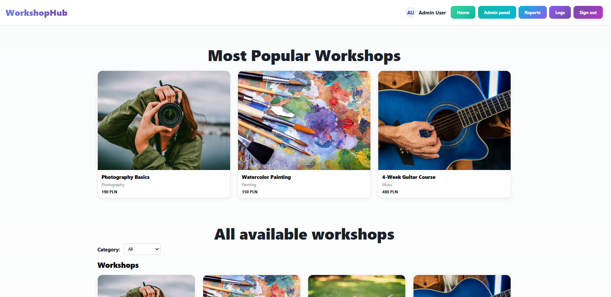
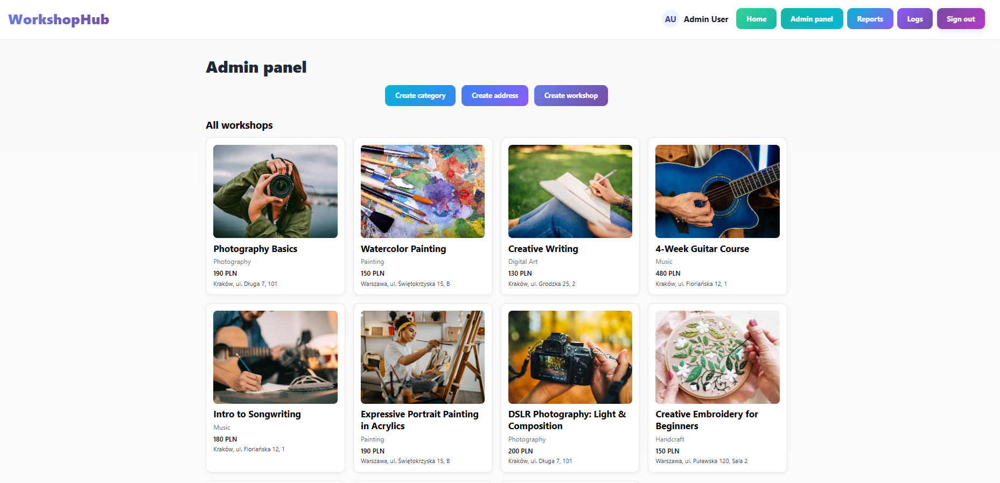
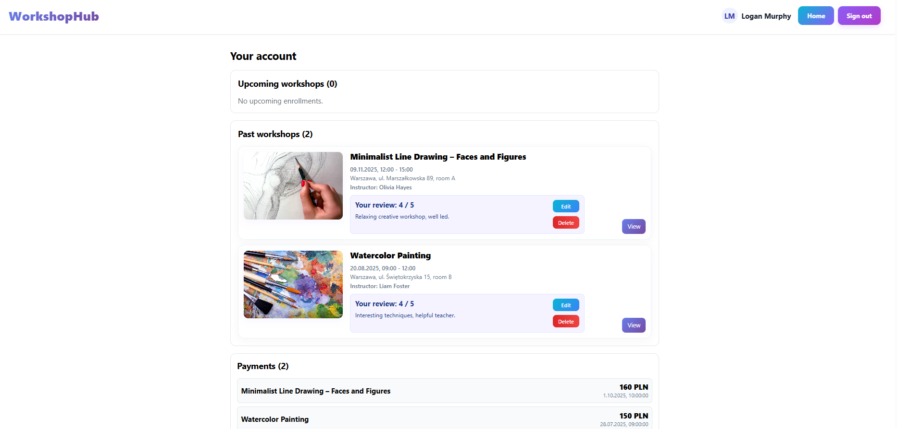

# WorkshopHub

A full-stack workshop management system built with ASP.NET Core 8.0 and React 18.

[](https://dotnet.microsoft.com/)
[](https://reactjs.org/)
[](https://www.microsoft.com/sql-server)

## Overview

WorkshopHub is a comprehensive workshop management platform designed for educational institutions and training centers. It enables administrators to create and manage workshops, instructors to organize their sessions, and participants to enroll and track their learning journey.

## Features

- **Role-Based Access Control** Three distinct roles (Admin, Instructor, Participant) with granular permissions
- **Workshop Management** Create single events or recurring workshop series with multiple sessions
- **Smart Enrollment System** Automatic capacity checking, payment tracking, and waitlist management
- **Payment Processing** Built-in payment status tracking (Pending, Paid, Cancelled)
- **Review & Rating System** Participant feedback with automatic rating calculations
- **Comprehensive Reporting** 6 different report types with PDF, CSV, and JSON export
- **Audit Logging** Database-level change tracking with SQL triggers
- **Image Management** Workshop image uploads with thumbnail generation

## Tech Stack

**Backend**
- ASP.NET Core 8.0 Web API
- Entity Framework Core 8.0
- SQL Server (LocalDB)
- JWT Authentication
- QuestPDF, ImageSharp

**Frontend**
- React 18 with Vite
- React Router v7
- Axios, jsPDF

**Database**
- 13 normalized tables
- Triggers, stored procedures, functions

## Quick Start

### Prerequisites

- .NET 8.0 SDK
- Node.js 18+
- SQL Server LocalDB

### Installation

```bash
# 1. Clone repository
git clone https://github.com/Z4phxr/Workshop_App.git
cd Workshop_App/Projekt

# 2. Restore dependencies
dotnet restore

# 3. Create database using EF migrations
dotnet ef database update

# 4. Start backend
dotnet run
# API runs at https://localhost:7271

# 5. Start frontend (new terminal)
cd ClientApp
npm install
npm run dev
# App runs at http://localhost:5173
```

**1. Admin password for testing**
- Email: admin@gmail.com
- Password: adminadmin


## Permissions

| Feature | Admin | Instructor | Participant |
|---------|:-----:|:----------:|:-----------:|
| Manage workshops | ✓ | Own only | ✗ |
| View reports | ✓ | ✓ | ✗ |
| Manage users | ✓ | ✗ | ✗ |
| Enroll in workshops | ✗ | ✗ | ✓ |
| Write reviews | ✗ | ✗| ✓ |

## Screenshots






## License

MIT License
